# Arabic TTS Model Training Pipeline

A comprehensive end-to-end pipeline for training custom Arabic Text-to-Speech models using personal WhatsApp voice notes. This project fine-tunes SparkAudio's Spark-TTS-0.5B model on custom voice data to create personalized voice cloning capabilities.

## 🎯 Project Overview

This pipeline transforms raw WhatsApp voice recordings into a production-ready TTS model through 8 carefully orchestrated stages:

1. **Data Extraction & Flattening**
2. **Audio Format Conversion**
3. **Speaker Verification & Filtering**
4. **Transcription**
5. **Dataset Upload to Hugging Face**
6. **Audio Tokenization**
7. **Model Training (Cloud)**
8. **Inference & Deployment**

## 📊 Pipeline Architecture

```
Raw WhatsApp Voice Notes (.opus)
           ↓
[1] Flatten Directory Structure
           ↓
[2] Convert to WAV (16kHz, Mono)
           ↓
[3] Speaker Verification (ECAPA-VOXCELEB)
           ↓
[4] Arabic Transcription (Whisper Large-v3)
           ↓
[5] Upload to Hugging Face
           ↓
[6] BiCodec Audio Tokenization
           ↓
[7] Fine-tune on Modal.com (A10G GPU)
           ↓
[8] Inference & Voice Generation
```

## 🛠️ Technical Stack

- **Audio Processing**: pydub, torchaudio
- **Speaker Recognition**: SpeechBrain (ECAPA-VOXCELEB)
- **Transcription**: faster-whisper (Large-v3 for Arabic dialects)
- **Model Architecture**: Spark-TTS-0.5B (Language Model + BiCodec)
- **Training Framework**: Unsloth (memory-efficient fine-tuning)
- **Cloud Training**: Modal.com
- **Dataset Hosting**: Hugging Face Hub

## 📁 Pipeline Stages Explained

### Stage 1: Flatten Directory Structure

**File**: `1_flatten.py`

WhatsApp exports voice notes in nested date-based folders. This script:

- Recursively finds all `.opus` files
- Renames them with parent folder prefix for uniqueness
- Consolidates into a single directory

python

```python
# Example transformation:
# 202445/PTT-20241201-WA0001.opus → 202445_PTT-20241201-WA0001.opus
```

### Stage 2: Audio Conversion

**File**: `2_convert_to_wav.py`

Converts proprietary formats to ML-ready audio:

- Codec: OPUS → WAV
- Sample Rate: 16kHz (optimal for speech models)
- Channels: Stereo → Mono
- Batch processing with error handling

### Stage 3: Speaker Verification

**File**: `3_filter_by_speaker_lvls.py`

Uses deep learning to filter recordings by voice similarity:

|Category|Threshold|Purpose|
|---|---|---|
|✅ Correct|Score ≥ 0.5|High confidence matches|
|⚠️ Review|0.3 ≤ Score < 0.5|Manual verification needed|
|❌ Rejected|Score < 0.3|Different speakers|

**Key Component**: Compares each file against a reference "anchor" recording using ECAPA-VOXCELEB embeddings.

### Stage 4: Transcription

**File**: `4_transcribe.py`

Generates training metadata using Whisper:

- Model: `large-v3` (best for Arabic dialects)
- Language hint: Jordanian Arabic
- Output: `metadata.csv` (filename|transcription pairs)

csv

`````csv
202445_PTT-20241201-WA0001.wav|هذا تسجيل بلهجة أردنية عامية
````

### Stage 5: Hugging Face Upload
**File**: `5_push_to_hf.py`

Packages dataset for cloud training:
- Creates Hugging Face `Dataset` object
- Casts audio column to proper format
- Pushes to private repository
- Enables version control and collaboration

### Stage 6: Audio Tokenization
**File**: `6_from_parquet_until_tokenization_with_no_training.py`

**This is the most complex stage** - converts audio into discrete tokens:

1. **Resampling**: Ensures 16kHz audio
2. **Feature Extraction**: Wav2Vec2 embeddings (layers 11, 14, 16)
3. **BiCodec Tokenization**:
   - **Semantic Tokens**: Content/phonetics (hundreds of tokens)
   - **Global Tokens**: Speaker identity (2-4 tokens)
4. **LLM Formatting**: Creates training strings like:
````
   <|task_tts|><|start_content|>النص العربي<|end_content|>
   <|start_global_token|><|bicodec_global_0|>...<|end_global_token|>
   <|start_semantic_token|><|bicodec_semantic_0|>...<|end_semantic_token|>
`````

**Memory Optimization**: Aggressive GPU memory management with immediate cleanup after tokenization.

### Stage 7: Cloud Training

**File**: `7_modal_training.py`

Trains on Modal.com infrastructure:

**Incremental Training Support**:

- Loads previous checkpoint if available
- Continues from last saved state
- Enables multi-dataset fine-tuning

**Training Configuration**:

python

```python
- GPU: A10G (24GB VRAM)
- Batch Size: 2 (with gradient accumulation 4x)
- Learning Rate: 2e-4
- Optimizer: AdamW 8-bit
- Epochs: 6
- Precision: FP32 (required for Spark-TTS)
```

**Safety Features**:

- Auto-push to Hugging Face every 500 steps
- Fallback upload on failure
- Persistent volume storage

### Stage 8: Inference

**File**: `8_inference_cpu.ipynb`

Generates speech from trained model:

**Components**:

1. **LLM**: Predicts audio token sequences from text
2. **BiCodec Decoder**: Converts tokens → waveform
3. **Post-processing**: 16kHz WAV export

**Architecture Fix**: Handles fine-tuned weights while maintaining base model architecture compatibility.

## 🚀 Quick Start

### Prerequisites

bash

```bash
# Core dependencies
pip install torch torchaudio transformers
pip install pydub speechbrain faster-whisper
pip install datasets huggingface_hub
pip install unsloth  # For training
pip install modal    # For cloud training
```

### Step-by-Step Execution

1. **Extract WhatsApp data** and update paths in `1_flatten.py`
2. **Run conversion pipeline**:

bash

```bash
   python 1_flatten.py
   python 2_convert_to_wav.py
```

3. **Record anchor sample** (15-30 seconds of your voice)
4. **Filter by speaker**:

bash

```bash
   python 3_filter_by_speaker_lvls.py
```

5. **Generate transcriptions**:

bash

```bash
   python 4_transcribe.py
```

6. **Upload to Hugging Face**:

bash

```bash
   huggingface-cli login
   python 5_push_to_hf.py
```

7. **Tokenize audio**:

bash

```bash
   python 6_from_parquet_until_tokenization_with_no_training.py
```

8. **Train on Modal**:

bash

```bash
   modal deploy 7_modal_training.py
```

9. **Generate speech**: Open `8_inference_cpu.ipynb`

## 📈 Results & Metrics

- **Dataset Size**: ~500-1000 voice notes recommended
- **Training Time**: ~4-6 hours on A10G
- **Model Size**: ~500MB (0.5B parameters)
- **Inference Speed**: ~5-10s per sentence (CPU)
- **Audio Quality**: 16kHz, clear reproduction

## 🎨 Interactive Pipeline Visualization

### Recommended Tools:

1. **Mermaid.js** (Best for GitHub README):

markdown

`````markdown
````mermaid
   graph TD
       A[Raw OPUS Files] --> B[Flatten Script]
       B --> C[WAV Conversion]
       C --> D[Speaker Filter]
       D --> E[Transcription]
       E --> F[HF Upload]
       F --> G[Tokenization]
       G --> H[Training]
       H --> I[Inference]
````
   
2. **Draw.io / Excalidraw**:
   - Create detailed flowchart
   - Export as SVG
   - Embed in `docs/pipeline.svg`

3. **Interactive Web Diagram**:
   - Use **Dagre-D3** or **Cytoscape.js**
   - Host on GitHub Pages
   - Add clickable nodes linking to files

4. **Jupyter Widget** (for notebook users):
````python
   import ipywidgets as widgets
   from IPython.display import display
   
   # Create interactive stage selector
````

### Example Mermaid Integration:

Add this to your `README.md`:
````markdown
## 🔄 Pipeline Workflow

```mermaid
flowchart LR
    A[📱 WhatsAppVoice Notes] -->|1_flatten.py| B[📁 FlatDirectory]
    B -->|2_convert_to_wav.py| C[🎵 WAVFiles]
    C -->|3_filter_by_speaker_lvls.py| D{🎯 SpeakerMatch?}
    D -->|✅ Correct| E[✔️ VerifiedAudio]
    D -->|❌ Rejected| F[🗑️ Discarded]
    E -->|4_transcribe.py| G[📝 MetadataCSV]
    G -->|5_push_to_hf.py| H[☁️ HuggingFaceDataset]
    H -->|6_tokenization.py| I[🔢 TokenizedData]
    I -->|7_modal_training.py| J[🧠 Fine-tunedModel]
    J -->|8_inference.ipynb| K[🗣️ GeneratedSpeech]
```

````

## 🐛 Common Issues & Solutions

| Issue | Solution |
|-------|----------|
| Out of Memory (OOM) | Reduce batch size, use gradient checkpointing |
| Poor transcription | Use dialect-specific prompts in Whisper |
| Low speaker accuracy | Record longer anchor (30+ seconds) |
| Slow tokenization | Process in smaller batches, use GPU |

## 🤝 Contributing

Improvements welcome! Areas of interest:
- Multi-speaker support
- Real-time inference optimization
- Additional Arabic dialect support
- GUI for non-technical users

## 📄 License

This project builds on:
- **Spark-TTS**: [SparkAudio/Spark-TTS](https://github.com/SparkAudio/Spark-TTS)
- **Unsloth**: [unslothai/unsloth](https://github.com/unslothai/unsloth)

## 🙏 Acknowledgments

- SparkAudio team for the base TTS architecture
- Anthropic Claude for pipeline guidance
- Hugging Face for model hosting infrastructure

---

**⚠️ Note**: This pipeline is designed for personal voice cloning only. Always obtain
`````